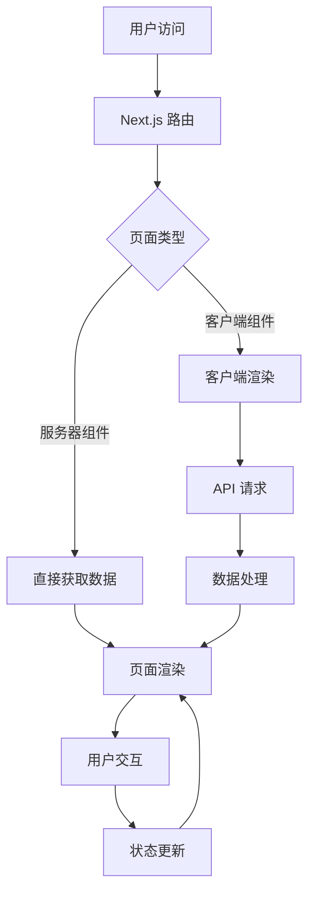
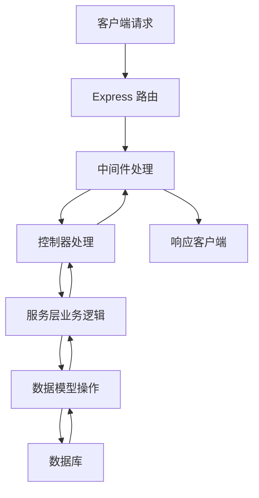

# 架构设计文档

## 前端架构

### 技术栈

| 技术 | 版本 | 用途 |
| --- | --- | --- |
| Next.js | 16.1.6 | 前端框架，提供 App Router、Server Components 等功能 |
| React | 19.2.4 | UI 库 |
| TypeScript | 5.7.3 | 类型系统 |
| Tailwind CSS | 4.2.0 | 样式框架 |
| Radix UI | 最新版 | 基础 UI 组件 |
| React Hook Form | 7.54.1 | 表单处理 |
| Zod | 3.24.1 | 数据验证 |
| Lucide React | 0.564.0 | 图标库 |
| Sonner | 1.7.1 | 通知组件 |
| Recharts | 2.15.0 | 图表库 |

### 架构设计

#### 1. 目录结构

```
frontend/
├── app/                    # Next.js App Router 页面
│   ├── dashboard/          # 个人中心
│   │   ├── earnings/       # 收益管理
│   │   ├── materials/      # 资料管理
│   │   ├── orders/         # 订单管理
│   │   ├── settings/       # 设置
│   │   ├── layout.tsx      # 仪表盘布局
│   │   └── page.tsx        # 仪表盘首页
│   ├── login/              # 登录页面
│   ├── materials/          # 资料相关页面
│   │   ├── [id]/           # 资料详情页
│   │   └── page.tsx        # 资料列表页
│   ├── register/           # 注册页面
│   ├── upload/             # 资料上传页面
│   ├── globals.css         # 全局样式
│   ├── layout.tsx          # 根布局
│   └── page.tsx            # 首页
├── components/             # 组件
│   ├── layout/             # 布局组件
│   │   ├── dashboard-sidebar.tsx  # 仪表盘侧边栏
│   │   ├── footer.tsx      # 页脚
│   │   └── header.tsx      # 头部
│   ├── ui/                 # UI 组件（基于 Radix UI）
│   ├── category-card.tsx   # 分类卡片
│   ├── file-upload.tsx     # 文件上传组件
│   ├── material-card.tsx   # 资料卡片
│   ├── purchase-dialog.tsx # 购买对话框
│   ├── stats-card.tsx      # 统计卡片
│   └── theme-provider.tsx  # 主题提供者
├── hooks/                  # 自定义钩子
│   ├── use-mobile.ts       # 移动端检测
│   └── use-toast.ts        # 通知钩子
├── lib/                    # 工具库
│   ├── mock-data.ts        # 模拟数据
│   └── utils.ts            # 工具函数
├── public/                 # 静态资源
└── styles/                 # 样式文件
```

#### 2. 核心模块

##### 2.1 路由系统
- 使用 Next.js App Router 实现客户端路由
- 支持嵌套路由和动态路由
- 实现路由守卫，保护需要登录的页面

##### 2.2 状态管理
- 采用 React Context API + useReducer 管理全局状态
- 局部状态使用 useState 和 useReducer
- 表单状态使用 React Hook Form

##### 2.3 数据流
- 服务器组件：直接从后端 API 获取数据
- 客户端组件：通过 fetch API 或 axios 请求数据
- 数据验证使用 Zod 进行类型检查和验证

##### 2.4 组件设计
- 原子组件：基于 Radix UI 封装的基础 UI 组件
- 分子组件：组合原子组件形成的功能组件
- 页面组件：由分子组件和原子组件构成的完整页面

##### 2.5 响应式设计
- 使用 Tailwind CSS 实现响应式布局
- 适配桌面端、平板端和移动端
- 针对不同设备优化用户体验

### 架构流程图



### 前端与后端交互

- 使用 RESTful API 进行数据交互
- 认证使用 JWT 令牌
- 文件上传使用 multipart/form-data
- 支付流程通过后端 API 与支付平台交互

### 性能优化

- 使用 Next.js 服务器组件减少客户端渲染负担
- 实现图片懒加载
- 代码分割，减少初始加载时间
- 缓存策略，提高重复访问速度
- 使用 React.memo 和 useMemo 优化渲染性能

### 安全措施

- 输入验证，防止 XSS 攻击
- API 调用添加认证令牌
- 敏感数据加密传输
- 防止 CSRF 攻击
- 定期更新依赖，修复安全漏洞

## 后端架构

### 技术栈

| 技术 | 版本 | 用途 |
| --- | --- | --- |
| Node.js | 22.20.0 | 运行环境 |
| Express | 4.18.2 | Web 框架 |
| TypeScript | 5.3.2 | 类型系统 |
| MySQL | 8.0+ | 数据库 |
| Sequelize | 7.6.3 | ORM 框架 |
| JWT | 9.0.2 | 认证令牌 |
| Multer | 1.4.5 | 文件上传 |
| Express Validator | 7.0.1 | 数据验证 |
| dotenv | 16.3.1 | 环境变量管理 |

### 架构设计

#### 1. 目录结构

```
backend/
├── src/
│   ├── config/          # 配置文件
│   │   ├── cors.ts      # CORS 配置
│   │   ├── database.ts  # 数据库连接配置
│   │   └── env.ts       # 环境变量配置
│   ├── controllers/     # 控制器
│   │   ├── auth.controller.ts      # 认证控制器
│   │   ├── materials.controller.ts # 素材控制器
│   │   ├── orders.controller.ts    # 订单控制器
│   │   └── earnings.controller.ts  # 收益控制器
│   ├── middleware/      # 中间件
│   │   ├── auth.middleware.ts     # 认证中间件
│   │   └── error.middleware.ts    # 错误处理中间件
│   ├── models/          # 数据模型
│   │   ├── user.model.ts        # 用户模型
│   │   ├── material.model.ts    # 素材模型
│   │   ├── tag.model.ts         # 标签模型
│   │   ├── order.model.ts       # 订单模型
│   │   └── earnings.model.ts    # 收益模型
│   ├── routes/          # 路由
│   │   ├── auth.routes.ts      # 认证路由
│   │   ├── materials.routes.ts # 素材路由
│   │   ├── orders.routes.ts    # 订单路由
│   │   └── earnings.routes.ts  # 收益路由
│   ├── services/        # 业务逻辑
│   │   ├── auth.service.ts      # 认证服务
│   │   ├── materials.service.ts # 素材服务
│   │   ├── orders.service.ts    # 订单服务
│   │   └── earnings.service.ts  # 收益服务
│   ├── utils/           # 工具函数
│   │   ├── jwt.ts        # JWT 工具
│   │   ├── password.ts   # 密码工具
│   │   └── upload.ts     # 文件上传工具
│   └── app.ts           # 应用入口
├── public/              # 静态文件
│   └── uploads/         # 上传的文件
├── package.json         # 依赖配置
├── tsconfig.json        # TypeScript 配置
├── .env                 # 环境变量
└── .env.example         # 环境变量示例
```

#### 2. 核心模块

##### 2.1 认证模块
- 用户注册和登录
- JWT 令牌生成和验证
- 密码加密和验证
- 个人资料管理

##### 2.2 素材模块
- 素材上传和管理
- 素材列表和详情
- 素材搜索和分类
- 标签管理

##### 2.3 订单模块
- 订单创建和管理
- 订单详情和状态更新
- 订单列表和查询

##### 2.4 收益模块
- 收益统计和分析
- 收益明细查询
- 收益来源管理

### 架构流程图



### 后端与前端交互

- 使用 RESTful API 进行数据交互
- 认证使用 JWT 令牌
- 文件上传使用 multipart/form-data
- 统一的错误处理和响应格式

### 数据库设计

#### 1. 表结构

##### users 表
| 字段名 | 数据类型 | 约束 | 描述 |
| --- | --- | --- | --- |
| id | INT | PRIMARY KEY, AUTO_INCREMENT | 用户ID |
| email | VARCHAR(255) | UNIQUE, NOT NULL | 邮箱 |
| password | VARCHAR(255) | NOT NULL | 密码（加密） |
| name | VARCHAR(255) | NOT NULL | 姓名 |
| role | ENUM('user', 'admin') | DEFAULT 'user' | 角色 |
| createdAt | DATETIME | NOT NULL | 创建时间 |
| updatedAt | DATETIME | NOT NULL | 更新时间 |

##### materials 表
| 字段名 | 数据类型 | 约束 | 描述 |
| --- | --- | --- | --- |
| id | INT | PRIMARY KEY, AUTO_INCREMENT | 素材ID |
| title | VARCHAR(255) | NOT NULL | 标题 |
| description | TEXT | NOT NULL | 描述 |
| fileUrl | VARCHAR(255) | NOT NULL | 文件路径 |
| thumbnailUrl | VARCHAR(255) | | 缩略图路径 |
| category | VARCHAR(100) | NOT NULL | 分类 |
| price | DECIMAL(10,2) | NOT NULL | 价格 |
| authorId | INT | FOREIGN KEY (users.id) | 作者ID |
| createdAt | DATETIME | NOT NULL | 创建时间 |
| updatedAt | DATETIME | NOT NULL | 更新时间 |

##### tags 表
| 字段名 | 数据类型 | 约束 | 描述 |
| --- | --- | --- | --- |
| id | INT | PRIMARY KEY, AUTO_INCREMENT | 标签ID |
| name | VARCHAR(50) | UNIQUE, NOT NULL | 标签名称 |
| createdAt | DATETIME | NOT NULL | 创建时间 |
| updatedAt | DATETIME | NOT NULL | 更新时间 |

##### material_tags 表
| 字段名 | 数据类型 | 约束 | 描述 |
| --- | --- | --- | --- |
| materialId | INT | PRIMARY KEY, FOREIGN KEY (materials.id) | 素材ID |
| tagId | INT | PRIMARY KEY, FOREIGN KEY (tags.id) | 标签ID |

##### orders 表
| 字段名 | 数据类型 | 约束 | 描述 |
| --- | --- | --- | --- |
| id | INT | PRIMARY KEY, AUTO_INCREMENT | 订单ID |
| buyerId | INT | FOREIGN KEY (users.id) | 买家ID |
| totalAmount | DECIMAL(10,2) | NOT NULL | 总金额 |
| status | ENUM('pending', 'completed', 'cancelled') | DEFAULT 'pending' | 状态 |
| createdAt | DATETIME | NOT NULL | 创建时间 |
| updatedAt | DATETIME | NOT NULL | 更新时间 |

##### order_items 表
| 字段名 | 数据类型 | 约束 | 描述 |
| --- | --- | --- | --- |
| id | INT | PRIMARY KEY, AUTO_INCREMENT | 订单详情ID |
| orderId | INT | FOREIGN KEY (orders.id) | 订单ID |
| materialId | INT | FOREIGN KEY (materials.id) | 素材ID |
| quantity | INT | NOT NULL | 数量 |
| price | DECIMAL(10,2) | NOT NULL | 单价 |
| createdAt | DATETIME | NOT NULL | 创建时间 |
| updatedAt | DATETIME | NOT NULL | 更新时间 |

##### earnings 表
| 字段名 | 数据类型 | 约束 | 描述 |
| --- | --- | --- | --- |
| id | INT | PRIMARY KEY, AUTO_INCREMENT | 收益ID |
| userId | INT | FOREIGN KEY (users.id) | 用户ID |
| amount | DECIMAL(10,2) | NOT NULL | 金额 |
| source | ENUM('sale', 'referral') | NOT NULL | 来源 |
| orderId | INT | FOREIGN KEY (orders.id) | 订单ID |
| createdAt | DATETIME | NOT NULL | 创建时间 |
| updatedAt | DATETIME | NOT NULL | 更新时间 |

### 性能优化

- 数据库索引优化
- 缓存策略
- 异步处理
- 代码优化

### 安全措施

- 密码加密存储
- JWT 认证
- 输入验证
- CORS 配置
- 防止 SQL 注入
- 环境变量管理
