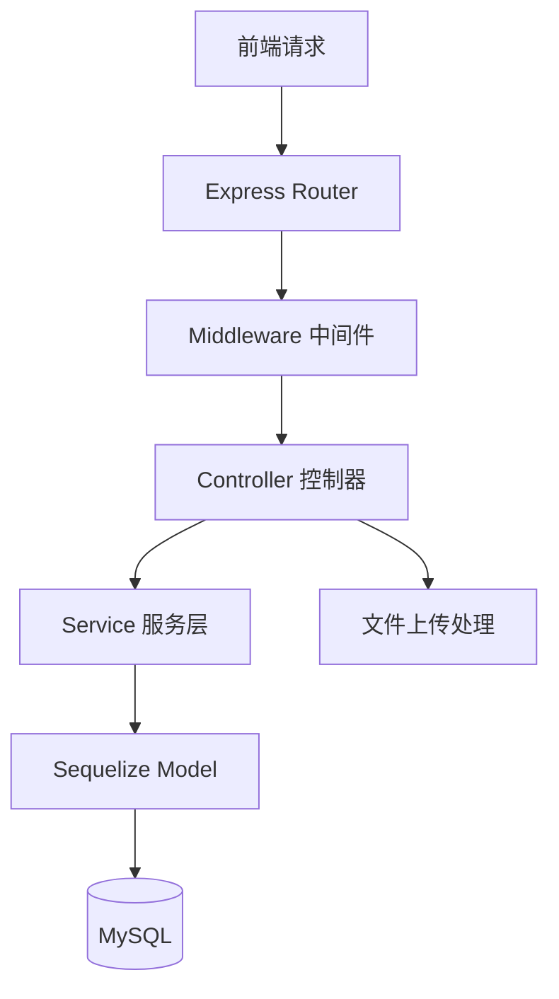
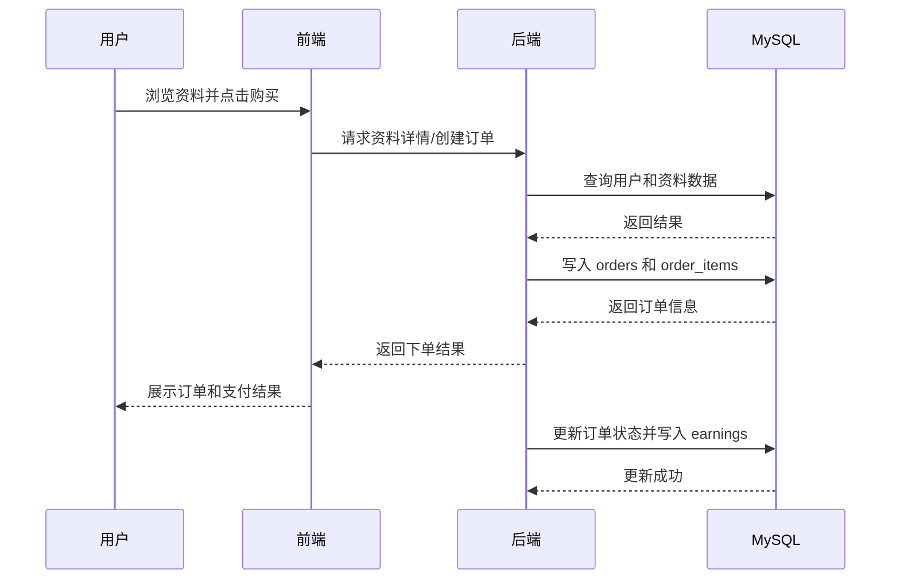

# 架构设计文档

## 1. 项目概述

本项目为“研途共享”考研资料付费共享平台，面向考研学生提供资料上传、浏览、购买、收益结算等功能。系统采用前后端分离架构，前端负责页面展示与交互，后端负责业务处理、权限控制和数据持久化。

## 2. 技术选型确认

| 层级 | 选择 | 理由 |
| --- | --- | --- |
| 前端框架 | Next.js + React + TypeScript | 已完成响应式页面和组件化开发，适合中小型课程项目快速迭代 |
| 后端框架 | Node.js + Express + TypeScript | 已完成后端项目初始化与模块划分，接口开发直接、生态成熟 |
| 数据库 | MySQL 8.0 | 支持事务、外键和关系建模，适合订单、抽成、收益等业务场景 |
| 部署方式 | Docker Compose | 便于统一管理前端、后端、数据库服务，适合后续部署扩展 |

## 3. 前端架构

### 3.1 技术栈

| 技术 | 版本 | 用途 |
| --- | --- | --- |
| Next.js | 16.1.6 | 前端框架，提供 App Router、页面组织能力 |
| React | 19.2.4 | UI 组件开发 |
| TypeScript | 5.7.3 | 类型约束 |
| Tailwind CSS | 4.2.0 | 样式开发 |
| Radix UI | 最新版 | 基础 UI 组件 |
| React Hook Form | 7.54.1 | 表单处理 |
| Zod | 3.24.1 | 数据校验 |

### 3.2 页面与组件结构

```
frontend/
├── app/
│   ├── page.tsx                 # 首页
│   ├── login/                   # 登录页
│   ├── register/                # 注册页
│   ├── materials/               # 资料列表 / 资料详情
│   ├── upload/                  # 资料上传页
│   └── dashboard/               # 个人中心
├── components/
│   ├── layout/                  # 头部、底部、侧边栏
│   ├── ui/                      # 通用 UI 组件
│   ├── material-card.tsx        # 资料卡片
│   ├── category-card.tsx        # 分类卡片
│   ├── file-upload.tsx          # 文件上传组件
│   └── purchase-dialog.tsx      # 购买弹窗
├── hooks/                       # 自定义 Hook
├── lib/                         # 工具函数和模拟数据
└── public/                      # 静态资源
```

### 3.3 前端架构图


## 4. 后端架构

### 4.1 技术栈

| 技术 | 版本 | 用途 |
| --- | --- | --- |
| Node.js | 22.20.0 | 运行环境 |
| Express | 4.18.2 | Web 框架 |
| TypeScript | 5.3.2 | 类型系统 |
| MySQL | 8.0+ | 数据库 |
| Sequelize | 7.6.3 | ORM 框架 |
| JWT | 9.0.2 | 用户认证 |
| Multer | 1.4.5 | 文件上传 |
| dotenv | 16.3.1 | 环境变量管理 |

### 4.2 模块划分

后端按“路由层 - 控制器层 - 服务层 - 数据模型层”进行划分：

1. 路由层：负责接口注册和请求分发。
2. 控制器层：负责请求参数处理和响应封装。
3. 服务层：负责认证、资料、订单、收益等业务逻辑。
4. 数据模型层：负责 MySQL 数据持久化和表关系映射。

### 4.3 后端目录结构

```
backend/
├── src/
│   ├── config/                  # 配置文件
│   ├── controllers/             # 控制器
│   ├── middleware/              # 中间件
│   ├── models/                  # 数据模型
│   ├── routes/                  # 路由
│   ├── services/                # 业务逻辑
│   ├── utils/                   # 工具函数
│   └── app.ts                   # 应用入口
├── .env.example                 # 环境变量示例
├── package.json                 # 依赖配置
└── tsconfig.json                # TypeScript 配置
```

### 4.4 后端模块设计

| 模块 | 职责 |
| --- | --- |
| 认证模块 | 注册、登录、JWT 鉴权、密码加密 |
| 资料模块 | 资料上传、分类查询、详情查看、标签管理 |
| 订单模块 | 创建订单、订单状态管理、购买记录查询 |
| 收益模块 | 收益统计、收益明细、收益来源查询 |
| 文件上传模块 | 文件接收、路径管理、上传校验 |

### 4.5 后端架构图



## 5. 数据库架构

数据库当前围绕用户、资料、订单、收益等实体展开，核心表包括：

1. `users`：平台用户信息。
2. `materials`：考研资料信息。
3. `orders`：订单主表。
4. `order_items`：订单明细。
5. `earnings`：收益记录。

数据库详细设计、ER 图和表结构说明见 [`docs/database.md`](/d:/pythonproject/yantushare/docs/database.md)。

## 6. 系统交互流程

### 6.1 核心业务流程

用户在前端浏览资料，选择目标资料后发起购买请求。后端接收请求后查询资料与用户信息，创建订单和订单明细，支付完成后更新订单状态并记录收益信息，最终由前端展示购买结果和订单记录。

### 6.2 系统交互流程图



## 7. 架构说明总结

1. 前端负责页面渲染、交互处理和 API 调用。
2. 后端负责接口分发、业务逻辑、认证和数据库操作。
3. 数据库负责持久化用户、资料、订单与收益数据。
4. 当前架构满足软件架构设计作业阶段要求，后续可继续扩展支付接口、对象存储和部署配置。
