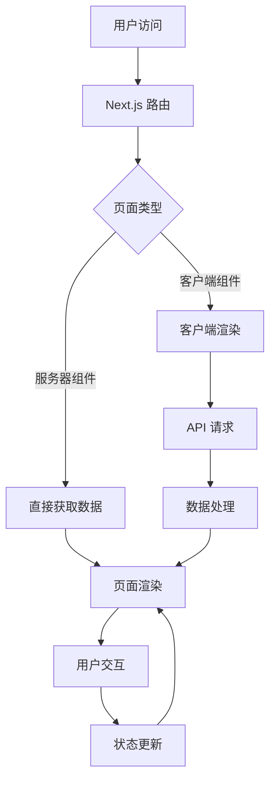

# 架构设计文档

## 前端架构

### 技术栈

| 技术 | 版本 | 用途 |
| --- | --- | --- |
| Next.js | 16.1.6 | 前端框架，提供 App Router、Server Components 等功能 |
| React | 19.2.4 | UI 库 |
| TypeScript | 5.7.3 | 类型系统 |
| Tailwind CSS | 4.2.0 | 样式框架 |
| Radix UI | 最新版 | 基础 UI 组件 |
| React Hook Form | 7.54.1 | 表单处理 |
| Zod | 3.24.1 | 数据验证 |
| Lucide React | 0.564.0 | 图标库 |
| Sonner | 1.7.1 | 通知组件 |
| Recharts | 2.15.0 | 图表库 |

### 架构设计

#### 1. 目录结构

```
frontend/
├── app/                    # Next.js App Router 页面
│   ├── dashboard/          # 个人中心
│   │   ├── earnings/       # 收益管理
│   │   ├── materials/      # 资料管理
│   │   ├── orders/         # 订单管理
│   │   ├── settings/       # 设置
│   │   ├── layout.tsx      # 仪表盘布局
│   │   └── page.tsx        # 仪表盘首页
│   ├── login/              # 登录页面
│   ├── materials/          # 资料相关页面
│   │   ├── [id]/           # 资料详情页
│   │   └── page.tsx        # 资料列表页
│   ├── register/           # 注册页面
│   ├── upload/             # 资料上传页面
│   ├── globals.css         # 全局样式
│   ├── layout.tsx          # 根布局
│   └── page.tsx            # 首页
├── components/             # 组件
│   ├── layout/             # 布局组件
│   │   ├── dashboard-sidebar.tsx  # 仪表盘侧边栏
│   │   ├── footer.tsx      # 页脚
│   │   └── header.tsx      # 头部
│   ├── ui/                 # UI 组件（基于 Radix UI）
│   ├── category-card.tsx   # 分类卡片
│   ├── file-upload.tsx     # 文件上传组件
│   ├── material-card.tsx   # 资料卡片
│   ├── purchase-dialog.tsx # 购买对话框
│   ├── stats-card.tsx      # 统计卡片
│   └── theme-provider.tsx  # 主题提供者
├── hooks/                  # 自定义钩子
│   ├── use-mobile.ts       # 移动端检测
│   └── use-toast.ts        # 通知钩子
├── lib/                    # 工具库
│   ├── mock-data.ts        # 模拟数据
│   └── utils.ts            # 工具函数
├── public/                 # 静态资源
└── styles/                 # 样式文件
```

#### 2. 核心模块

##### 2.1 路由系统
- 使用 Next.js App Router 实现客户端路由
- 支持嵌套路由和动态路由
- 实现路由守卫，保护需要登录的页面

##### 2.2 状态管理
- 采用 React Context API + useReducer 管理全局状态
- 局部状态使用 useState 和 useReducer
- 表单状态使用 React Hook Form

##### 2.3 数据流
- 服务器组件：直接从后端 API 获取数据
- 客户端组件：通过 fetch API 或 axios 请求数据
- 数据验证使用 Zod 进行类型检查和验证

##### 2.4 组件设计
- 原子组件：基于 Radix UI 封装的基础 UI 组件
- 分子组件：组合原子组件形成的功能组件
- 页面组件：由分子组件和原子组件构成的完整页面

##### 2.5 响应式设计
- 使用 Tailwind CSS 实现响应式布局
- 适配桌面端、平板端和移动端
- 针对不同设备优化用户体验

### 架构流程图



### 前端与后端交互

- 使用 RESTful API 进行数据交互
- 认证使用 JWT 令牌
- 文件上传使用 multipart/form-data
- 支付流程通过后端 API 与支付平台交互

### 性能优化

- 使用 Next.js 服务器组件减少客户端渲染负担
- 实现图片懒加载
- 代码分割，减少初始加载时间
- 缓存策略，提高重复访问速度
- 使用 React.memo 和 useMemo 优化渲染性能

### 安全措施

- 输入验证，防止 XSS 攻击
- API 调用添加认证令牌
- 敏感数据加密传输
- 防止 CSRF 攻击
- 定期更新依赖，修复安全漏洞
