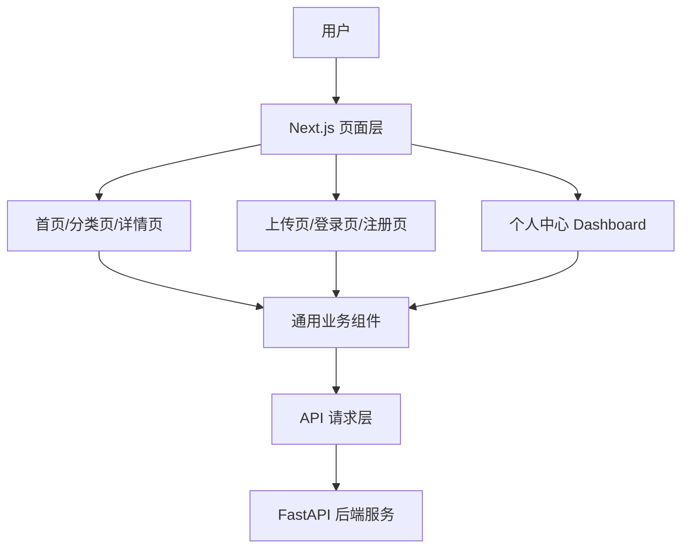
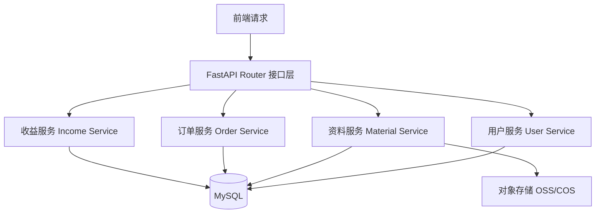
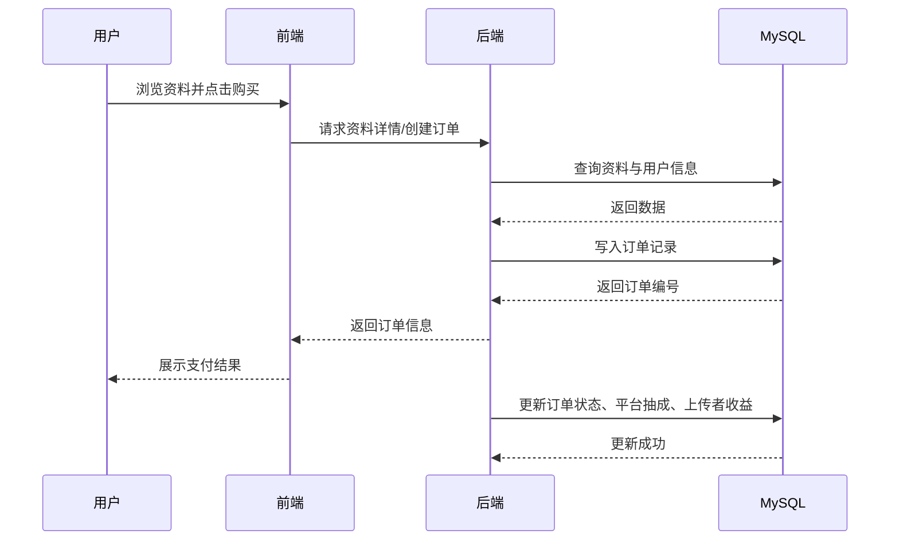

# 架构设计文档

## 1. 项目概述

本项目为“研途共享”考研资料付费共享平台，面向考研学生提供资料上传、浏览、购买、收益结算等功能。系统采用前后端分离架构，前端负责页面展示与交互，后端负责业务处理、权限控制和数据持久化。

## 2. 技术选型确认

| 层级 | 选择 | 理由 |
| --- | --- | --- |
| 前端框架 | Next.js + React + TypeScript | 已完成页面搭建，组件化能力强，适合响应式 Web 项目 |
| 后端框架 | FastAPI | 开发效率高，接口文档自动生成，适合课程项目快速落地 |
| 数据库 | MySQL 8.0 | 支持事务和外键，适合订单、抽成、收益等关系型业务 |
| 部署方式 | Docker Compose | 便于统一管理前端、后端、数据库服务，后续部署清晰 |

## 3. 前端架构

### 3.1 技术栈

| 技术 | 版本 | 用途 |
| --- | --- | --- |
| Next.js | 16.1.6 | 前端框架，提供 App Router、页面组织能力 |
| React | 19.2.4 | UI 组件开发 |
| TypeScript | 5.7.3 | 类型约束 |
| Tailwind CSS | 4.2.0 | 样式开发 |
| Radix UI | 最新版 | 基础 UI 组件 |
| React Hook Form | 7.54.1 | 表单处理 |
| Zod | 3.24.1 | 数据校验 |

### 3.2 页面与组件结构

```
frontend/
├── app/
│   ├── page.tsx                 # 首页
│   ├── login/                   # 登录页
│   ├── register/                # 注册页
│   ├── materials/               # 资料列表 / 资料详情
│   ├── upload/                  # 资料上传页
│   └── dashboard/               # 个人中心
├── components/
│   ├── layout/                  # 头部、底部、侧边栏
│   ├── ui/                      # 通用 UI 组件
│   ├── material-card.tsx        # 资料卡片
│   ├── category-card.tsx        # 分类卡片
│   ├── file-upload.tsx          # 文件上传组件
│   └── purchase-dialog.tsx      # 购买弹窗
├── hooks/                       # 自定义 Hook
├── lib/                         # 工具函数和模拟数据
└── public/                      # 静态资源
```

### 3.3 前端架构图



## 4. 后端架构

### 4.1 模块划分

后端按“接口层 - 业务层 - 数据层”进行划分：

1. 接口层：处理 HTTP 请求、参数校验、返回统一响应。
2. 业务层：处理用户、资料、订单、收益等核心业务逻辑。
3. 数据层：负责 MySQL 数据读写和实体关系维护。

### 4.2 后端模块设计

| 模块 | 职责 |
| --- | --- |
| 用户模块 | 注册、登录、身份认证、权限校验 |
| 资料模块 | 资料上传、分类查询、详情查看、状态管理 |
| 订单模块 | 创建订单、支付状态更新、购买记录查询 |
| 收益模块 | 平台抽成计算、上传者收益统计、提现记录管理 |
| 文件存储模块 | 文件上传路径管理，后续接入 OSS / COS |

### 4.3 后端架构图



## 5. 数据库架构

数据库当前设计 3 个核心表：

1. `users`：平台用户信息。
2. `materials`：考研资料信息。
3. `orders`：资料订单及收益分配信息。

数据库详细设计、ER 图和建表 SQL 见 [`docs/database.md`](/d:/pythonproject/yantushare/docs/database.md)。

## 6. 系统交互流程

### 6.1 核心业务流程

用户在前端浏览资料，选择目标资料后发起购买请求。后端创建订单并完成支付结果处理，随后更新订单状态、记录平台抽成和上传者收益，最后前端展示购买结果和订单信息。

### 6.2 系统交互流程图



## 7. 架构说明总结

1. 前端负责页面展示、表单交互和 API 调用。
2. 后端负责业务逻辑、鉴权、订单处理和数据库操作。
3. 数据库负责持久化用户、资料和订单数据。
4. 当前架构满足课程作业阶段需求，后续可以继续扩展支付接口、对象存储和部署配置。
