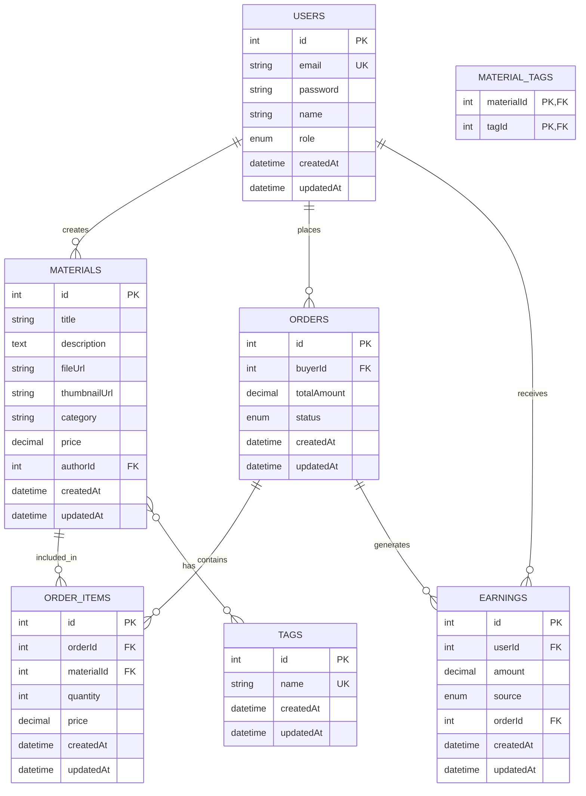

# 数据库设计文档

## 1. 数据库概述

本项目使用 MySQL 作为数据库管理系统，采用 Sequelize ORM 进行数据库操作。数据库设计遵循关系型数据库设计原则，确保数据的完整性、一致性和可扩展性。

## 2. 数据库表结构

### 2.1 表结构概览

| 表名 | 描述 | 关联关系 |
| --- | --- | --- |
| `users` | 用户表 | 与 materials、orders、earnings 表关联 |
| `materials` | 素材表 | 与 users、order_items 表关联 |
| `tags` | 标签表 | 与 materials 表多对多关联 |
| `material_tags` | 素材标签关联表 | 关联 materials 和 tags 表 |
| `orders` | 订单表 | 与 users、order_items、earnings 表关联 |
| `order_items` | 订单详情表 | 与 orders、materials 表关联 |
| `earnings` | 收益表 | 与 users、orders 表关联 |

### 2.2 详细表结构

#### 2.2.1 users 表

| 字段名 | 数据类型 | 约束 | 描述 |
| --- | --- | --- | --- |
| `id` | `INT` | `PRIMARY KEY, AUTO_INCREMENT` | 用户ID |
| `email` | `VARCHAR(255)` | `UNIQUE, NOT NULL` | 邮箱 |
| `password` | `VARCHAR(255)` | `NOT NULL` | 密码（加密存储） |
| `name` | `VARCHAR(255)` | `NOT NULL` | 姓名 |
| `role` | `ENUM('user', 'admin')` | `DEFAULT 'user'` | 角色 |
| `createdAt` | `DATETIME` | `NOT NULL` | 创建时间 |
| `updatedAt` | `DATETIME` | `NOT NULL` | 更新时间 |

#### 2.2.2 materials 表

| 字段名 | 数据类型 | 约束 | 描述 |
| --- | --- | --- | --- |
| `id` | `INT` | `PRIMARY KEY, AUTO_INCREMENT` | 素材ID |
| `title` | `VARCHAR(255)` | `NOT NULL` | 标题 |
| `description` | `TEXT` | `NOT NULL` | 描述 |
| `fileUrl` | `VARCHAR(255)` | `NOT NULL` | 文件路径 |
| `thumbnailUrl` | `VARCHAR(255)` | | 缩略图路径 |
| `category` | `VARCHAR(100)` | `NOT NULL` | 分类 |
| `price` | `DECIMAL(10,2)` | `NOT NULL` | 价格 |
| `authorId` | `INT` | `FOREIGN KEY (users.id)` | 作者ID |
| `createdAt` | `DATETIME` | `NOT NULL` | 创建时间 |
| `updatedAt` | `DATETIME` | `NOT NULL` | 更新时间 |

#### 2.2.3 tags 表

| 字段名 | 数据类型 | 约束 | 描述 |
| --- | --- | --- | --- |
| `id` | `INT` | `PRIMARY KEY, AUTO_INCREMENT` | 标签ID |
| `name` | `VARCHAR(50)` | `UNIQUE, NOT NULL` | 标签名称 |
| `createdAt` | `DATETIME` | `NOT NULL` | 创建时间 |
| `updatedAt` | `DATETIME` | `NOT NULL` | 更新时间 |

#### 2.2.4 material_tags 表

| 字段名 | 数据类型 | 约束 | 描述 |
| --- | --- | --- | --- |
| `materialId` | `INT` | `PRIMARY KEY, FOREIGN KEY (materials.id)` | 素材ID |
| `tagId` | `INT` | `PRIMARY KEY, FOREIGN KEY (tags.id)` | 标签ID |

#### 2.2.5 orders 表

| 字段名 | 数据类型 | 约束 | 描述 |
| --- | --- | --- | --- |
| `id` | `INT` | `PRIMARY KEY, AUTO_INCREMENT` | 订单ID |
| `buyerId` | `INT` | `FOREIGN KEY (users.id)` | 买家ID |
| `totalAmount` | `DECIMAL(10,2)` | `NOT NULL` | 总金额 |
| `status` | `ENUM('pending', 'completed', 'cancelled')` | `DEFAULT 'pending'` | 状态 |
| `createdAt` | `DATETIME` | `NOT NULL` | 创建时间 |
| `updatedAt` | `DATETIME` | `NOT NULL` | 更新时间 |

#### 2.2.6 order_items 表

| 字段名 | 数据类型 | 约束 | 描述 |
| --- | --- | --- | --- |
| `id` | `INT` | `PRIMARY KEY, AUTO_INCREMENT` | 订单详情ID |
| `orderId` | `INT` | `FOREIGN KEY (orders.id)` | 订单ID |
| `materialId` | `INT` | `FOREIGN KEY (materials.id)` | 素材ID |
| `quantity` | `INT` | `NOT NULL` | 数量 |
| `price` | `DECIMAL(10,2)` | `NOT NULL` | 单价 |
| `createdAt` | `DATETIME` | `NOT NULL` | 创建时间 |
| `updatedAt` | `DATETIME` | `NOT NULL` | 更新时间 |

#### 2.2.7 earnings 表

| 字段名 | 数据类型 | 约束 | 描述 |
| --- | --- | --- | --- |
| `id` | `INT` | `PRIMARY KEY, AUTO_INCREMENT` | 收益ID |
| `userId` | `INT` | `FOREIGN KEY (users.id)` | 用户ID |
| `amount` | `DECIMAL(10,2)` | `NOT NULL` | 金额 |
| `source` | `ENUM('sale', 'referral')` | `NOT NULL` | 来源 |
| `orderId` | `INT` | `FOREIGN KEY (orders.id)` | 订单ID |
| `createdAt` | `DATETIME` | `NOT NULL` | 创建时间 |
| `updatedAt` | `DATETIME` | `NOT NULL` | 更新时间 |

## 3. 数据库关系图 (ER 图)

## 4. 索引设计

### 4.1 主键索引
- 所有表的 `id` 字段都设置为主键，自动创建主键索引

### 4.2 唯一索引
- `users.email`：确保邮箱唯一性
- `tags.name`：确保标签名称唯一性
- `material_tags.materialId, material_tags.tagId`：确保素材和标签的组合唯一性

### 4.3 普通索引
- `materials.authorId`：加速查询用户的素材
- `materials.category`：加速按分类查询素材
- `orders.buyerId`：加速查询用户的订单
- `order_items.orderId`：加速查询订单的详情
- `order_items.materialId`：加速查询素材的订单
- `earnings.userId`：加速查询用户的收益
- `earnings.orderId`：加速查询订单的收益

## 5. 数据完整性约束

### 5.1 实体完整性
- 所有表都有主键约束
- 外键引用确保关联数据的完整性

### 5.2 域完整性
- 使用适当的数据类型和约束确保数据有效性
- 使用 `NOT NULL` 约束确保必要字段不为空
- 使用 `ENUM` 类型限制枚举值
- 使用 `DECIMAL` 类型确保金额精度

### 5.3 参照完整性
- 外键约束确保关联数据的一致性
- 级联操作确保数据同步

## 6. 数据迁移策略

### 6.1 初始化
- 使用 Sequelize 的 `sync({ alter: true })` 自动创建和更新表结构
- 确保数据库连接配置正确

### 6.2 数据备份
- 定期备份数据库
- 保存备份文件到安全位置

### 6.3 数据恢复
- 建立数据恢复流程
- 测试恢复过程确保可靠性

## 7. 性能优化策略

### 7.1 查询优化
- 使用索引加速查询
- 优化 SQL 查询语句
- 避免 N+1 查询问题

### 7.2 存储优化
- 合理设计表结构
- 避免冗余数据
- 定期清理无用数据

### 7.3 连接优化
- 使用连接池管理数据库连接
- 合理设置连接超时
- 监控连接状态

## 8. 安全措施

### 8.1 数据安全
- 密码加密存储
- 防止 SQL 注入
- 输入验证和清理

### 8.2 访问控制
- 基于角色的权限控制
- 限制数据库用户权限
- 定期更新数据库密码

### 8.3 审计日志
- 记录重要操作
- 监控异常访问
- 定期检查日志

## 9. 数据库管理

### 9.1 数据库用户
- 创建专用数据库用户
- 分配适当的权限
- 定期更新用户密码

### 9.2 监控与维护
- 监控数据库性能
- 定期检查数据库状态
- 优化数据库配置

### 9.3 版本管理
- 记录数据库结构变更
- 管理数据库版本
- 确保开发、测试和生产环境的一致性

## 10. 总结

本数据库设计文档详细描述了项目的数据库结构、关系和优化策略。通过合理的表设计、索引优化和安全措施，确保数据库能够高效、安全地支持项目的各项功能。同时，文档提供了完整的 ER 图，直观展示了表之间的关系，为开发人员理解数据库结构提供了便利。

随着项目的发展，数据库设计可能需要根据实际需求进行调整和优化，建议定期 review 和更新数据库设计文档。