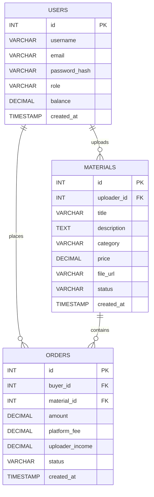

# 数据库设计文档

## 1. 数据库选型

| 项目 | 选择 |
| --- | --- |
| 数据库 | MySQL 8.0+ |
| 存储引擎 | InnoDB |
| 字符集 | utf8mb4 |

### 选型理由

1. 平台存在注册、资料上传、订单支付、平台抽成、收益结算等强事务场景，适合使用关系型数据库。
2. MySQL 生态成熟，和 FastAPI、SQLAlchemy 配合方便，适合课程项目开发。
3. InnoDB 支持事务和外键，便于保证订单金额、平台分成和上传者收益的一致性。

## 2. 核心实体说明

本阶段先设计 3 个核心数据表，满足作业“至少 3 个核心表”的要求：

1. `users`：存储平台用户信息。
2. `materials`：存储考研资料信息。
3. `orders`：存储资料购买记录与收益分配信息。

## 3. 数据表设计

### 3.1 用户表 `users`

| 字段名 | 类型 | 约束 | 说明 |
| --- | --- | --- | --- |
| `id` | INT | PK, AUTO_INCREMENT | 用户主键 |
| `username` | VARCHAR(50) | NOT NULL, UNIQUE | 用户名 |
| `email` | VARCHAR(100) | NOT NULL, UNIQUE | 邮箱 |
| `password_hash` | VARCHAR(255) | NOT NULL | 密码哈希 |
| `role` | VARCHAR(20) | NOT NULL, DEFAULT 'user' | 用户角色 |
| `balance` | DECIMAL(10,2) | NOT NULL, DEFAULT 0.00 | 当前余额 |
| `created_at` | TIMESTAMP | NOT NULL, DEFAULT CURRENT_TIMESTAMP | 创建时间 |

### 3.2 资料表 `materials`

| 字段名 | 类型 | 约束 | 说明 |
| --- | --- | --- | --- |
| `id` | INT | PK, AUTO_INCREMENT | 资料主键 |
| `uploader_id` | INT | NOT NULL, FK -> users.id | 上传者 ID |
| `title` | VARCHAR(100) | NOT NULL | 资料标题 |
| `description` | TEXT | NULL | 资料描述 |
| `category` | VARCHAR(30) | NOT NULL | 资料分类 |
| `price` | DECIMAL(10,2) | NOT NULL | 售价 |
| `file_url` | VARCHAR(255) | NOT NULL | 文件路径 |
| `status` | VARCHAR(20) | NOT NULL, DEFAULT 'active' | 资料状态 |
| `created_at` | TIMESTAMP | NOT NULL, DEFAULT CURRENT_TIMESTAMP | 上传时间 |

### 3.3 订单表 `orders`

| 字段名 | 类型 | 约束 | 说明 |
| --- | --- | --- | --- |
| `id` | INT | PK, AUTO_INCREMENT | 订单主键 |
| `buyer_id` | INT | NOT NULL, FK -> users.id | 购买者 ID |
| `material_id` | INT | NOT NULL, FK -> materials.id | 资料 ID |
| `amount` | DECIMAL(10,2) | NOT NULL | 订单总金额 |
| `platform_fee` | DECIMAL(10,2) | NOT NULL | 平台抽成金额 |
| `uploader_income` | DECIMAL(10,2) | NOT NULL | 上传者收益 |
| `status` | VARCHAR(20) | NOT NULL, DEFAULT 'pending' | 订单状态 |
| `created_at` | TIMESTAMP | NOT NULL, DEFAULT CURRENT_TIMESTAMP | 创建时间 |

## 4. ER 图

下面是标准 Mermaid `erDiagram` 语法，放到支持 Mermaid 的 Markdown 预览器里即可显示。



### 关系说明

1. 一个用户可以上传多份资料，所以 `users` 和 `materials` 是一对多关系。
2. 一个用户可以产生多条订单，所以 `users` 和 `orders` 是一对多关系。
3. 一份资料可以被多个用户购买，所以 `materials` 和 `orders` 是一对多关系。

## 5. 建表 SQL

```sql
CREATE TABLE users (
    id INT PRIMARY KEY AUTO_INCREMENT,
    username VARCHAR(50) NOT NULL UNIQUE,
    email VARCHAR(100) NOT NULL UNIQUE,
    password_hash VARCHAR(255) NOT NULL,
    role VARCHAR(20) NOT NULL DEFAULT 'user',
    balance DECIMAL(10,2) NOT NULL DEFAULT 0.00,
    created_at TIMESTAMP NOT NULL DEFAULT CURRENT_TIMESTAMP
) ENGINE=InnoDB DEFAULT CHARSET=utf8mb4;

CREATE TABLE materials (
    id INT PRIMARY KEY AUTO_INCREMENT,
    uploader_id INT NOT NULL,
    title VARCHAR(100) NOT NULL,
    description TEXT,
    category VARCHAR(30) NOT NULL,
    price DECIMAL(10,2) NOT NULL,
    file_url VARCHAR(255) NOT NULL,
    status VARCHAR(20) NOT NULL DEFAULT 'active',
    created_at TIMESTAMP NOT NULL DEFAULT CURRENT_TIMESTAMP,
    CONSTRAINT fk_material_uploader
        FOREIGN KEY (uploader_id) REFERENCES users(id)
        ON DELETE CASCADE
) ENGINE=InnoDB DEFAULT CHARSET=utf8mb4;

CREATE TABLE orders (
    id INT PRIMARY KEY AUTO_INCREMENT,
    buyer_id INT NOT NULL,
    material_id INT NOT NULL,
    amount DECIMAL(10,2) NOT NULL,
    platform_fee DECIMAL(10,2) NOT NULL,
    uploader_income DECIMAL(10,2) NOT NULL,
    status VARCHAR(20) NOT NULL DEFAULT 'pending',
    created_at TIMESTAMP NOT NULL DEFAULT CURRENT_TIMESTAMP,
    CONSTRAINT fk_order_buyer
        FOREIGN KEY (buyer_id) REFERENCES users(id)
        ON DELETE CASCADE,
    CONSTRAINT fk_order_material
        FOREIGN KEY (material_id) REFERENCES materials(id)
        ON DELETE CASCADE
) ENGINE=InnoDB DEFAULT CHARSET=utf8mb4;
```

## 6. 设计说明

1. 订单表中单独保存 `platform_fee` 和 `uploader_income`，避免后续重复计算造成金额偏差。
2. 所有主表都带有 `created_at` 字段，方便后续统计和审计。
3. 当前阶段先满足课程作业的最小闭环，后续可以继续扩展 `reviews`、`withdrawals` 等业务表。
