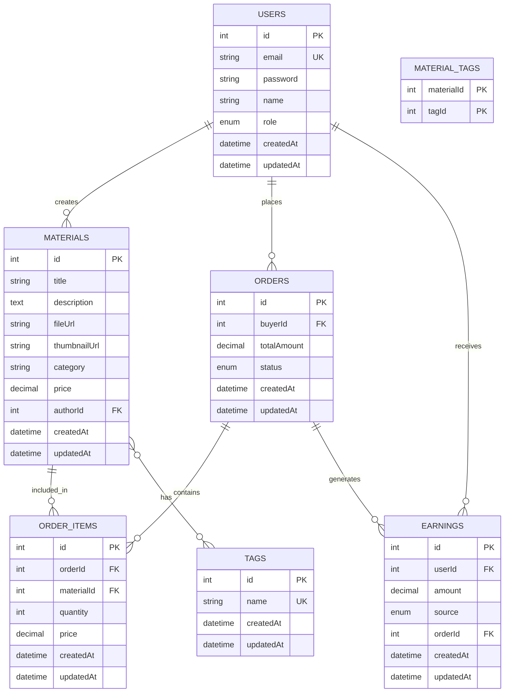

# 数据库设计文档

## 1. 数据库概述

本项目使用 MySQL 作为数据库管理系统，后端采用 Sequelize ORM 进行数据库操作。数据库设计围绕“用户、资料、订单、收益”四类核心业务展开，保证数据的完整性、一致性和可扩展性。

## 2. 数据库选型

| 项目 | 选择 |
| --- | --- |
| 数据库 | MySQL 8.0+ |
| ORM | Sequelize |
| 字符集 | utf8mb4 |

### 选型理由

1. 平台包含资料上传、订单创建、支付结算、收益统计等典型关系型业务。
2. MySQL 支持事务和外键，适合订单与收益场景。
3. Sequelize 便于和当前后端 `Node.js + Express + TypeScript` 项目配合使用。

## 3. 核心表结构设计

### 3.1 表结构概览

| 表名 | 描述 | 作用 |
| --- | --- | --- |
| `users` | 用户表 | 存储平台用户信息 |
| `materials` | 资料表 | 存储上传的考研资料 |
| `tags` | 标签表 | 存储资料标签 |
| `material_tags` | 资料标签关联表 | 建立资料和标签的多对多关系 |
| `orders` | 订单表 | 存储订单主记录 |
| `order_items` | 订单明细表 | 存储订单中的资料明细 |
| `earnings` | 收益表 | 存储平台收益或用户收益记录 |

### 3.2 详细表结构

#### 3.2.1 `users`

| 字段名 | 数据类型 | 约束 | 说明 |
| --- | --- | --- | --- |
| `id` | INT | PK, AUTO_INCREMENT | 用户主键 |
| `email` | VARCHAR(255) | UNIQUE, NOT NULL | 用户邮箱 |
| `password` | VARCHAR(255) | NOT NULL | 加密后的密码 |
| `name` | VARCHAR(255) | NOT NULL | 用户昵称/姓名 |
| `role` | ENUM('user', 'admin') | DEFAULT 'user' | 用户角色 |
| `createdAt` | DATETIME | NOT NULL | 创建时间 |
| `updatedAt` | DATETIME | NOT NULL | 更新时间 |

#### 3.2.2 `materials`

| 字段名 | 数据类型 | 约束 | 说明 |
| --- | --- | --- | --- |
| `id` | INT | PK, AUTO_INCREMENT | 资料主键 |
| `title` | VARCHAR(255) | NOT NULL | 资料标题 |
| `description` | TEXT | NOT NULL | 资料描述 |
| `fileUrl` | VARCHAR(255) | NOT NULL | 文件路径 |
| `thumbnailUrl` | VARCHAR(255) | NULL | 缩略图路径 |
| `category` | VARCHAR(100) | NOT NULL | 资料分类 |
| `price` | DECIMAL(10,2) | NOT NULL | 售价 |
| `authorId` | INT | FK -> users.id | 上传者 ID |
| `createdAt` | DATETIME | NOT NULL | 创建时间 |
| `updatedAt` | DATETIME | NOT NULL | 更新时间 |

#### 3.2.3 `tags`

| 字段名 | 数据类型 | 约束 | 说明 |
| --- | --- | --- | --- |
| `id` | INT | PK, AUTO_INCREMENT | 标签主键 |
| `name` | VARCHAR(50) | UNIQUE, NOT NULL | 标签名称 |
| `createdAt` | DATETIME | NOT NULL | 创建时间 |
| `updatedAt` | DATETIME | NOT NULL | 更新时间 |

#### 3.2.4 `material_tags`

| 字段名 | 数据类型 | 约束 | 说明 |
| --- | --- | --- | --- |
| `materialId` | INT | PK, FK -> materials.id | 资料 ID |
| `tagId` | INT | PK, FK -> tags.id | 标签 ID |

#### 3.2.5 `orders`

| 字段名 | 数据类型 | 约束 | 说明 |
| --- | --- | --- | --- |
| `id` | INT | PK, AUTO_INCREMENT | 订单主键 |
| `buyerId` | INT | FK -> users.id | 购买者 ID |
| `totalAmount` | DECIMAL(10,2) | NOT NULL | 订单总金额 |
| `status` | ENUM('pending', 'completed', 'cancelled') | DEFAULT 'pending' | 订单状态 |
| `createdAt` | DATETIME | NOT NULL | 创建时间 |
| `updatedAt` | DATETIME | NOT NULL | 更新时间 |

#### 3.2.6 `order_items`

| 字段名 | 数据类型 | 约束 | 说明 |
| --- | --- | --- | --- |
| `id` | INT | PK, AUTO_INCREMENT | 订单明细主键 |
| `orderId` | INT | FK -> orders.id | 订单 ID |
| `materialId` | INT | FK -> materials.id | 资料 ID |
| `quantity` | INT | NOT NULL | 购买数量 |
| `price` | DECIMAL(10,2) | NOT NULL | 下单时单价 |
| `createdAt` | DATETIME | NOT NULL | 创建时间 |
| `updatedAt` | DATETIME | NOT NULL | 更新时间 |

#### 3.2.7 `earnings`

| 字段名 | 数据类型 | 约束 | 说明 |
| --- | --- | --- | --- |
| `id` | INT | PK, AUTO_INCREMENT | 收益记录主键 |
| `userId` | INT | FK -> users.id | 收益归属用户 ID |
| `amount` | DECIMAL(10,2) | NOT NULL | 金额 |
| `source` | ENUM('sale', 'referral') | NOT NULL | 收益来源 |
| `orderId` | INT | FK -> orders.id | 关联订单 ID |
| `createdAt` | DATETIME | NOT NULL | 创建时间 |
| `updatedAt` | DATETIME | NOT NULL | 更新时间 |

## 4. ER 图

## 5. 关系说明

1. 一个用户可以上传多份资料，因此 `users` 与 `materials` 是一对多关系。
2. 一个用户可以创建多笔订单，因此 `users` 与 `orders` 是一对多关系。
3. 一笔订单可以包含多条订单明细，因此 `orders` 与 `order_items` 是一对多关系。
4. 一份资料可以出现在多条订单明细中，因此 `materials` 与 `order_items` 是一对多关系。
5. 资料和标签之间是多对多关系，通过 `material_tags` 关联表实现。
6. 收益记录与用户、订单建立关联，便于后续收益统计。

## 6. 索引与约束设计

### 6.1 索引设计

- 主键索引：所有表的 `id` 字段默认建立主键索引。
- 唯一索引：`users.email`、`tags.name`。
- 普通索引：`materials.authorId`、`materials.category`、`orders.buyerId`、`order_items.orderId`、`earnings.userId`。

### 6.2 数据完整性约束

- 使用主键约束保证实体唯一性。
- 使用外键约束保证表之间引用关系正确。
- 使用 `NOT NULL`、`ENUM`、`DECIMAL` 等约束保证字段有效性。

## 7. 数据迁移与管理说明

1. 开发阶段可使用 Sequelize 同步模型创建表结构。
2. 后续若项目继续推进，建议补充正式 migration 脚本。
3. 数据库应定期备份，并保留恢复方案。

## 8. 总结

本数据库设计满足软件架构设计作业要求，已包含核心数据表设计、ER 图和关系说明。当前设计既能支撑课程阶段的资料交易流程，也方便后续继续扩展支付、评价、提现等业务模块。
