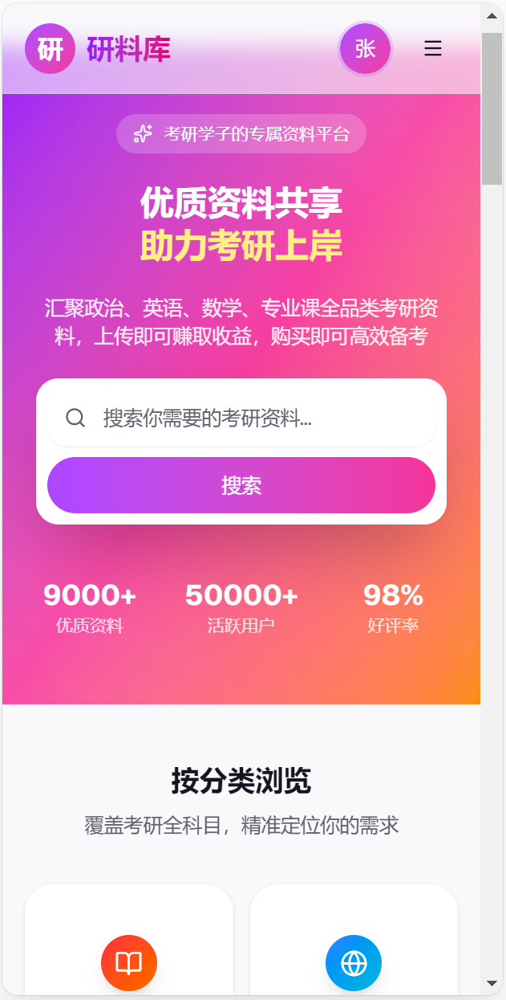
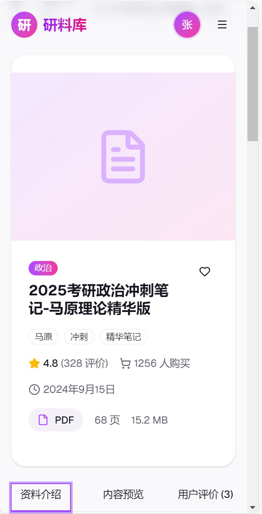
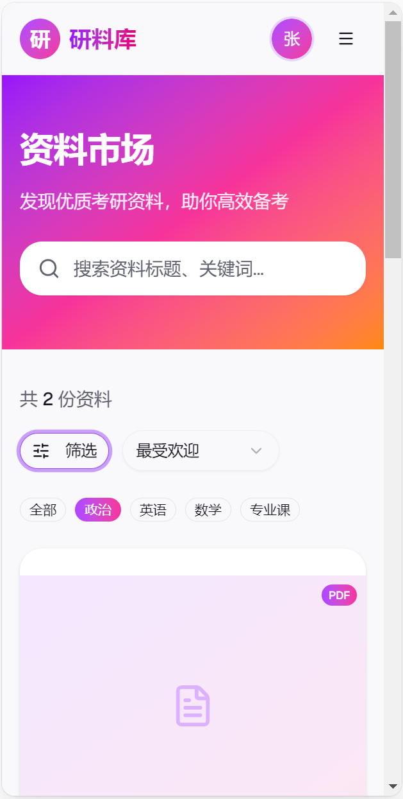

# 设计说明

## 设计工具

- **设计平台**：v0.dev
- **设计链接**：[https://v0.app/chat/-my0oYyN2GRT?ref=BHS4JI](https://v0.app/chat/-my0oYyN2GRT?ref=BHS4JI)
- **技术栈**：Vue 3 + Vite + Element Plus + Axios + Pinia + Vue Router
- **设计截图**：docs/design/ 目录

## 设计截图

### 首页设计

### 资料详情页设计

### 分类页设计

## 配色方案

- **主色**：#409EFF（现代蓝色，体现专业与信任感）
- **辅助色**：#67C23A（活力绿色，代表成功与积极）
- **强调色**：#F56C6C（警示红色，用于错误提示与重要操作）
- **背景色**：#F5F7FA（舒适浅灰，营造清爽的阅读环境）
- **文字色**：#303133（深灰文字，保证最佳可读性）
- **边框色**：#DCDFE6（中性边框，保持界面整洁）
- **卡片背景**：#FFFFFF（纯白卡片，突出内容）

## 字体规范

- **标题字体**：PingFang SC, Microsoft YaHei, sans-serif（加粗，字号 18px-24px，行高 1.5）
- **正文字体**：PingFang SC, Microsoft YaHei, sans-serif（常规，字号 14px-16px，行高 1.6）
- **小字/辅助文字**：PingFang SC, Microsoft YaHei, sans-serif（常规，字号 12px-13px，行高 1.4）
- **代码/数字**：Consolas, Monaco, monospace（常规，字号 14px）

## 布局规范

- **PC 端**：1920×1080px（内容区域 1200px 居中，最小宽度 1024px）
- **平板端**：768px-1023px（响应式布局）
- **移动端**：375×812px（单列布局，最小宽度 320px）

- **间距系统**：8px 基础单位，常用间距：8px、16px、24px、32px、48px
- **圆角规范**：按钮 4px，卡片 8px，弹窗 12px
- **阴影规范**：卡片阴影 0 2px 12px 0 rgba(0, 0, 0, 0.1)，弹窗阴影 0 4px 16px 0 rgba(0, 0, 0, 0.15)

## 核心页面设计

### 1. 首页
- **顶部导航**：Logo、主导航（首页、分类、上传）、用户操作（登录/注册/个人中心）
- **英雄区域**：全屏轮播图，展示热门资料和平台特色
- **分类导航**：横向卡片式分类入口（政治、英语、数学、专业课）
- **最新资料**：网格布局，卡片展示，包含封面、标题、价格、作者信息
- **热门推荐**：精选资料推荐，突出显示
- **底部信息**：版权信息、联系方式、快速链接

### 2. 分类页
- **左侧筛选**：固定宽度 240px，包含分类树、价格区间、标签筛选
- **右侧内容**：
  - 排序选项（最新、热门、价格从低到高、价格从高到低）
  - 资料卡片网格（响应式布局，PC 端 3-4 列）
  - 分页组件（位于底部，显示总条数和页码）

### 3. 上传页
- **表单区域**：居中布局，最大宽度 800px
- **资料信息**：标题输入、分类选择、标签输入、详细描述（富文本编辑器）
- **文件上传**：拖拽上传区域，支持 PDF/Word 格式，显示上传进度
- **价格设置**：数字输入框，支持小数，实时显示预览
- **操作按钮**：预览、保存草稿、提交审核

### 4. 资料详情页
- **左侧内容**：资料标题、作者信息、发布时间、浏览次数、详细描述、资料预览（PDF 预览器）
- **右侧边栏**：作者卡片、价格信息、购买按钮、相关推荐资料
- **评论区域**：用户评论列表、评论输入框

### 5. 支付页面
- **订单信息**：资料名称、价格、购买数量、总价
- **支付方式**：微信支付、支付宝支付选项卡
- **支付状态**：支付中（loading 动画）、支付成功（绿色成功提示）、支付失败（红色错误提示）
- **跳转逻辑**：支付成功后自动跳转到资料下载页面

### 6. 个人中心
- **左侧菜单**：用户头像、用户名、功能导航（个人信息、我的资料、我的订单、收益管理、提现记录）
- **右侧内容**：
  - 个人信息：基本信息展示与编辑
  - 我的资料：上传的资料列表，支持编辑、上下架、删除
  - 我的订单：购买记录，支持下载、查看详情
  - 收益管理：收益概览、收益明细、提现申请
  - 提现记录：提现历史，显示状态

## 组件设计

### 1. 资料卡片
- **尺寸**：PC 端 280px×320px，移动端 100% 宽度
- **结构**：封面图（16:9）、标题（2 行截断）、作者信息、价格、标签
- **交互**：鼠标悬停时轻微上浮效果，点击进入详情页

### 2. 按钮组件
- **主按钮**：#409EFF 背景，白色文字，44px 高度，4px 圆角
- **次按钮**：白色背景，#409EFF 边框和文字，44px 高度，4px 圆角
- **危险按钮**：#F56C6C 背景，白色文字，44px 高度，4px 圆角
- **禁用状态**：灰色背景，文字变灰，鼠标指针变为禁用状态

### 3. 表单组件
- **输入框**：40px 高度，4px 圆角，1px 边框，聚焦时边框变为 #409EFF
- **选择器**：与输入框相同高度和样式
- **上传组件**：虚线边框，拖拽时边框变为 #409EFF，显示上传区域提示

### 4. 导航组件
- **顶部导航**：64px 高度，白色背景，阴影效果
- **面包屑导航**：16px 高度，显示当前页面路径
- **分页组件**：居中对齐，显示页码、上一页、下一页

## 交互设计

### 1. 页面导航
- **顶部导航**：点击菜单项平滑过渡到对应页面
- **面包屑**：点击层级链接返回对应页面
- **底部链接**：点击快速跳转到相关页面

### 2. 资料交互
- **卡片悬停**：鼠标悬停时卡片轻微上浮，显示阴影效果
- **点击卡片**：平滑跳转到资料详情页
- **下拉刷新**：移动端支持下拉刷新页面数据
- **无限滚动**：滚动到页面底部自动加载更多资料

### 3. 表单交互
- **实时验证**：输入时实时显示验证结果
- **错误提示**：输入错误时显示红色错误信息
- **成功提示**：操作成功时显示绿色成功信息
- **表单提交**：提交时显示 loading 动画，防止重复提交

### 4. 支付交互
- **支付弹窗**：点击购买按钮弹出模态框
- **支付状态**：实时显示支付进度
- **支付结果**：支付完成后显示结果提示
- **自动跳转**：支付成功后自动跳转到下载页面

### 5. 加载状态
- **页面加载**：使用骨架屏显示内容占位
- **数据加载**：使用 loading 动画显示加载状态
- **按钮加载**：按钮点击后显示 loading 状态，禁用按钮

## 响应式设计

### 1. PC 端（≥1024px）
- 多列布局，充分利用屏幕空间
- 左侧固定导航，右侧内容区域
- 卡片网格布局，3-4 列

### 2. 平板端（768px-1023px）
- 响应式调整布局，减少列数
- 左侧导航可折叠
- 保持核心功能完整

### 3. 移动端（<768px）
- 单列布局，垂直排列内容
- 顶部导航变为汉堡菜单
- 底部导航栏，方便移动端操作
- 触摸友好的按钮尺寸（最小 44px×44px）

## 性能优化

- **图片优化**：使用 WebP 格式，懒加载
- **代码分割**：路由级别的代码分割
- **组件缓存**：使用 keep-alive 缓存常用组件
- **网络优化**：使用 CDN 加速静态资源
- **构建优化**：Tree-shaking，代码压缩

## 无障碍设计

- **键盘导航**：支持键盘 Tab 键导航
- **屏幕阅读器**：添加适当的 aria 属性
- **颜色对比度**：确保文字与背景的对比度符合 WCAG 标准
- **字体大小**：支持系统字体大小调整
- **焦点状态**：清晰的焦点样式，便于键盘用户识别
